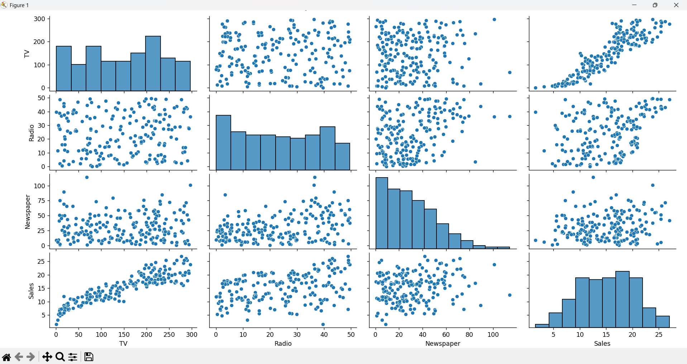
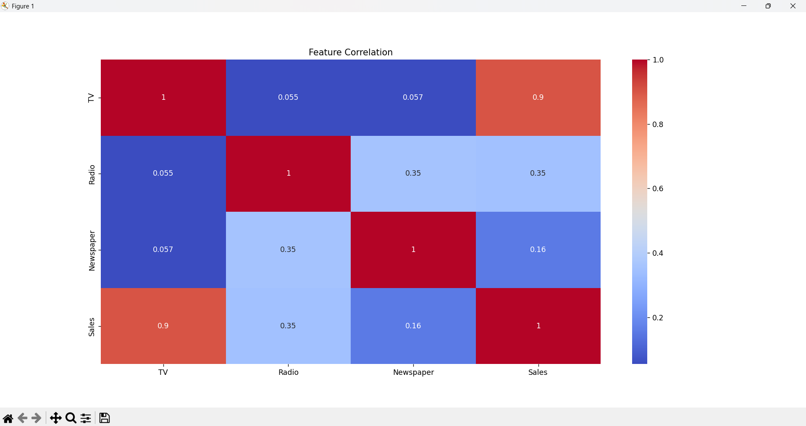
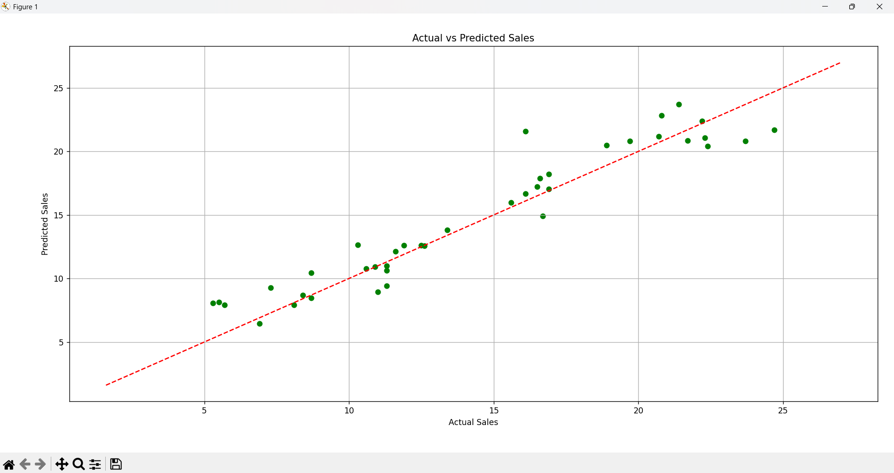

# Sales-Prediction# Sales Prediction using Python 📊

## 📌 Objective
To build a regression model that predicts **product sales** based on advertising spend across **TV, Radio, and Newspaper** channels.

## 📊 Dataset
- Source: [Kaggle - Sales Prediction Dataset](https://www.kaggle.com/code/ashydv/sales-prediction-simple-linear-regression/input)
- File Used: `advertising.csv`

## 🧰 Tools & Libraries
- Python
- Pandas, NumPy
- Matplotlib, Seaborn
- Scikit-learn

## 🔧 Data Preprocessing
- Explored relationships between features and target (`Sales`)
- Visualized feature correlation using heatmap
- Used `TV`, `Radio`, and `Newspaper` as input features

## 🧠 Model Used
- **Linear Regression**

## 🧪 Evaluation Metrics
- Mean Absolute Error (MAE)
- Root Mean Squared Error (RMSE)
- R² Score

---

## 📈 Output Visualizations

### 🔹 1. Pairplot – Features vs Sales
A visual comparison of every feature against `Sales`.

---

### 🔹 2. Correlation Heatmap
Shows the strength of relationships between features.

---

### 🔹 3. Actual vs Predicted Sales
Visual comparison of predicted vs actual sales values. The closer the dots are to the red line, the better the model’s predictions.

---
